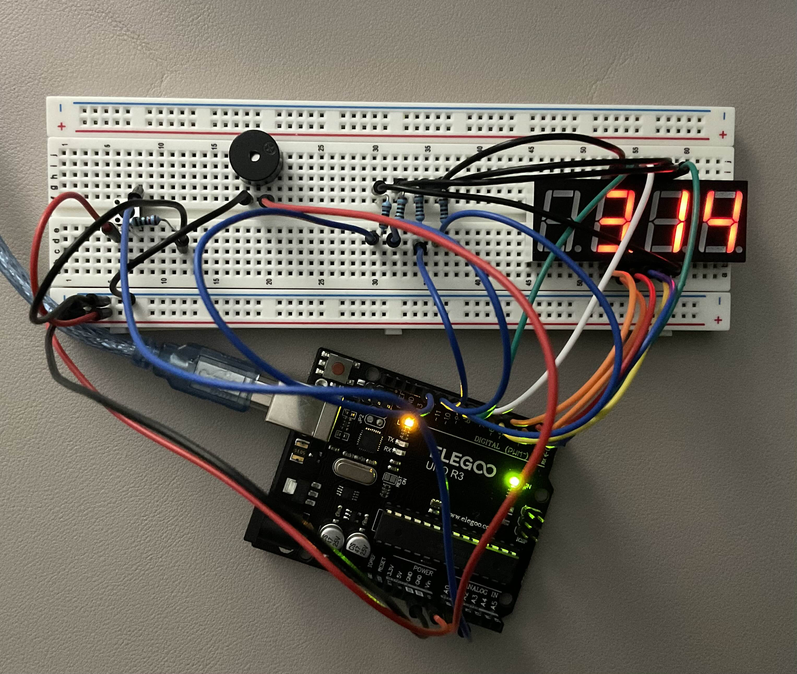

# Fight-Clock

Fight-Clock is an interval timer designed for boxing, MMA, and workout rounds. It features a buzzer to signal the start and end of rounds, and allows you to customize the round length, break-between-rounds length, and the number of rounds. Additionally, it includes a pause button for added flexibility during your training sessions.

## Features

- **Adjustable Round Length:** Set the duration of each round to suit your training needs.
- **Adjustable Break Length:** Customize the length of breaks between rounds.
- **Configurable Number of Rounds:** Choose the total number of rounds for your workout.
- **Buzzer Alerts:** Audible alerts to signal the start and end of each round.
- **Pause Button:** Pause the timer at any point during your workout.

### Changeable Parameters
- FIGHT_TIME: length of each round
- BREAK_TIME: time between rounds
- TOTAL_ROUNDS: total number of rounds

Made for the Arduino UNO R3
